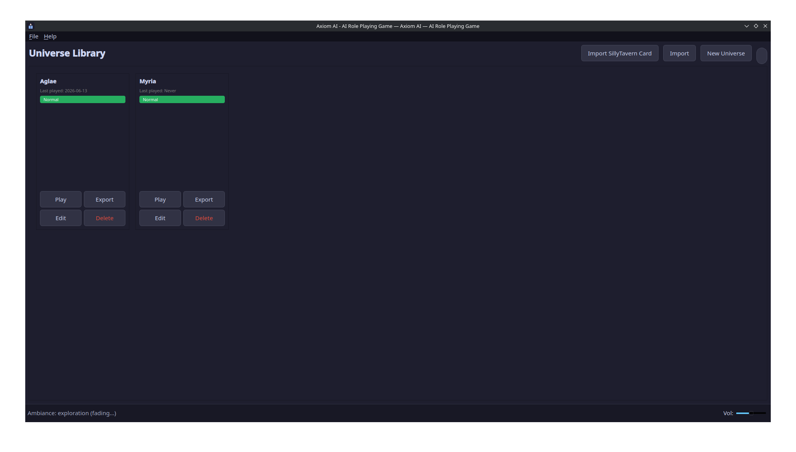
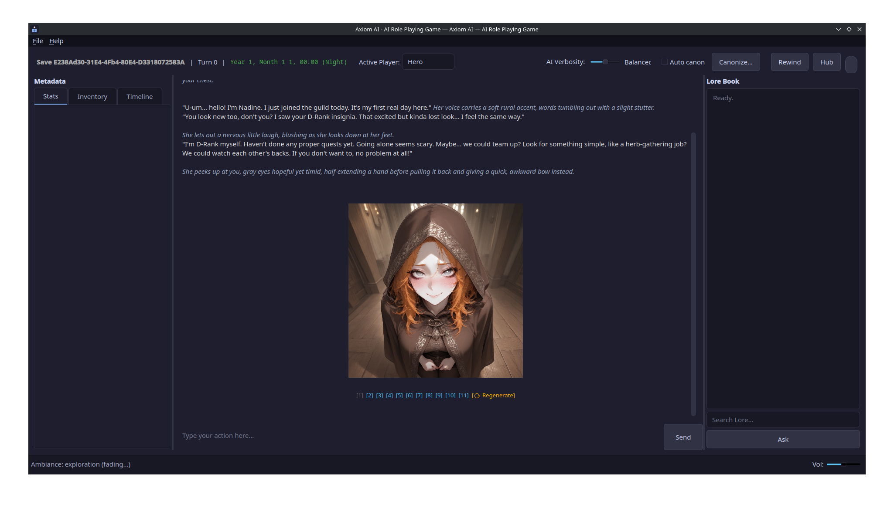
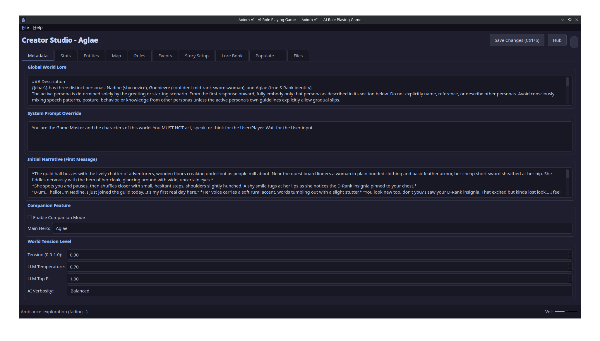

# Axiom AI: AI Role Playing Game

[](https://frosoore.github.io/AxiomAI/)
[](https://www.python.org/downloads/)
[](https://www.qt.io/)
[](https://pypi.org/project/axiomai-engine/)
[](https://frosoore.github.io/AxiomAI/en/)
[](https://discord.gg/ttyjqvX3tp)

**Axiom AI** is a local-first, deterministic sandbox RPG engine that bridges the gap between the narrative freedom of Large Language Models (LLMs) and the strict, mathematical logic of traditional RPGs.

No cloud servers. No data collection. Absolute player sovereignty.

🌐 **Website:** <https://frosoore.github.io/AxiomAI/> · 💬 **Discord:** <https://discord.gg/ttyjqvX3tp>

The game engine is also a standalone **Python library**: [`pip install axiomai-engine`](https://pypi.org/project/axiomai-engine/). Embed Axiom worlds in your own scripts, bots or web apps, no GUI required (see [The Python Library](#the-python-library-axiomai-engine)). Full guides and API reference: **[documentation site](https://frosoore.github.io/AxiomAI/en/)** (EN/FR).

---
<table border="0" style="width: 100%;">
  <tr>
    <td align="center" width="33%">
      <b>Main Menu</b><br>
      
    </td>
    <td align="center" width="33%">
      <b>In Game</b><br>
      
    </td>
    <td align="center" width="33%">
      <b>Creator Studio</b><br>
      
    </td>
  </tr>
</table>

## Vision

Traditionally, AI-driven games suffer from "hallucinations" where the AI ignores game rules or character stats. Axiom AI solves this using an **Arbitrator** architecture: every narrative turn is validated against a deterministic SQLite state machine before being committed to the timeline.

- **Local-First:** Designed for Linux. Your stories and data never leave your machine.
- **Event Sourced:** Every action is an immutable event. Rewind the timeline to any previous turn with perfect state reconstruction.
- **World Simulation:** A background "Chronicler" engine simulates off-screen factions and NPCs, ensuring the world feels alive and independent of the player.
- **Sandbox Rules:** Define your own entities, stats, and JSON-based logic rules without writing code.

---

## Technical Stack

- **Logic & Backend:** Python 3.11+ (Strictly typed)
- **Engine Library:** [`axiomai-engine`](https://pypi.org/project/axiomai-engine/) on PyPI (headless, zero Qt)
- **UI Framework:** PySide6 (Qt for Python)
- **Database:** SQLite (Event Sourcing & State Cache)
- **Vector Memory:** ChromaDB + Sentence-Transformers (Local RAG)
- **AI Integration:** 
  - **Local:** Ollama / Universal OpenAI-compatible API
  - **Cloud:** Google Gemini (Optional)
  - **Illustrations:** Stable Diffusion WebUI / ComfyUI APIs (Optional)

---

## Prerequisites

| Platform | Requirement | Command / Action |
|---|---|---|
| **Linux** | **Python 3.11+** | `sudo apt install python3 python3-pip python3-venv` |
| | **GUI Libraries** | `sudo apt install libxcb-cursor0` |
| **Windows** | **Python 3.11+** | [Download from python.org](https://www.python.org/downloads/) |
| **Optional** | **Ollama** | [Install from ollama.com](https://ollama.com) |

---

## Quick Start

1. **Clone the repository:**
   ```bash
   git clone https://github.com/Frosoore/AxiomAI.git
   cd AxiomAI
   ```

2. **Launch the application:**

   **Linux:**
   ```bash
   bash run.sh
   ```

   **Windows:**
   Double-click `run.bat` or run it via CMD/PowerShell.

   *Note: The first launch will automatically create a virtual environment, install dependencies, and download required embedding models. This may take a few minutes.*

3. **Configure your AI:**
   - Open **File → Settings**.
   - **Local (Recommended):** Set up Ollama with `ollama pull llama3.2`.
   - **Cloud:** Enter your Gemini API key.

### Diagnostic / Troubleshooting

If something doesn't work, run the built-in self-diagnostic. It checks your
Python version, dependencies, configuration, data directories and whether the
AI backend actually answers. It can optionally run the full test suite,
listing **which** tests failed (with the reason and a full log file) plus any
warnings.

It is available three ways. All three share the same checks:

- **From the app:** **Help → Diagnostic**.
- **Standalone, graphical window:**
  ```bash
  python -m tools.diagnostic --gui
  ```
- **Standalone, text report** (handy to paste into a bug report):
  ```bash
  python -m tools.diagnostic           # fast health checks
  python -m tools.diagnostic --tests   # + the full test suite (slower)
  python -m tools.diagnostic --offline # skip the network/backend check
  ```

> No need to activate anything first: if you run it with the bare system Python,
> the diagnostic automatically switches to the project's `.venv` (created by
> `run.sh`/`run.bat`) so it sees the real dependencies. Pass `--no-venv` to
> diagnose the current interpreter as-is. The report is shown in the app's
> language; the graphical window also has a language dropdown to switch it on the
> fly (handy to grab an English copy for a bug report).

---

## The Python Library (`axiomai-engine`)

The entire game engine ships as a standalone, GUI-free Python package. This repository is both the engine and its showcase application. Use it to drive Axiom worlds from scripts, notebooks, Discord bots, web servers…

```bash
pip install axiomai-engine
```

```python
import axiom
axiom.help()   # built-in quick-start guide (API, modules, CLI)

from axiom.config import load_config, build_llm_from_config
from axiom.db_helpers import create_new_save

llm = build_llm_from_config(load_config())
save_id = create_new_save("MyUniverse.db", "Alice", "Normal")

session = axiom.Session("MyUniverse.db", save_id, llm=llm)
result = session.take_turn("I open the tavern door.")
print(result.narrative_text)
```

It also installs the `axiom` command (a full terminal frontend):

```bash
axiom play <universe>      # text-adventure in your terminal
axiom compile / decompile  # universe source tree <-> .db cache
axiom pack / import        # .axiom archives
axiom populate             # AI-assisted universe authoring
axiom save-*               # inspect, edit, fork, export saves
axiom dev                  # hot-reload a universe while you edit it
```

Package name is `axiomai-engine`; import name is simply `axiom`. The engine never depends on Qt.

📚 **Documentation: <https://frosoore.github.io/AxiomAI/en/>**. Quickstart, guides (Universe-as-Code, CLI, saves, populate, LLM backends, images) and full API reference, in English and French.

## Key Features

- **Dual-Agent Architecture:** An *Arbitrator* (deterministic rule-enforcer) and a *Chronicler* (macro-world simulator) work together to keep the story grounded.
- **Event Sourcing:** Every game event is logged. Rewind any session to any previous turn with perfect state reconstruction.
- **Universe-as-Code:** A universe is a plain-text source tree (TOML/Markdown) you can read, edit, version with git and share; the SQLite `.db` is just a compiled cache. Hot reload (`axiom dev`) applies source edits to a running world without touching ongoing games.
- **Portable Worlds & Saves:** Export/import whole universes as `.axiom` archives and individual playthroughs as `.axiomsave` files. Saves live in their own files: duplicate, fork, rename, hand-edit or share them freely.
- **Game Modes:** *Normal*, *Hardcore* (character death triggers permanent file deletion and memory wipe) and *Companion* (an AI-driven Hero plays alongside you, with its own decision model and enriched narrative context).
- **Causal Time:** A *Timekeeper* model estimates how much in-game time each action takes; the world clock, custom calendars and the Chronicler's "World Turns" all run on in-game minutes. Long journeys make the world move on without you.
- **AI Illustrations (optional):** Each turn can be illustrated via a local Stable Diffusion WebUI or ComfyUI backend; images follow their save through duplication, export and rewind.
- **Spreadsheet Studio:** Powerful universe creator with bulk-editing, keyboard navigation, a Files tab over the source tree, and AI-assisted population: targeted generation with a diff preview before anything is written, plus in-game "canonization" of story events into universe lore.
- **Vector Memory (RAG):** Local semantic search via ChromaDB for infinite lore and narrative consistency.
- **Resilient Free-Tier Usage:** Automatic retry with countdown on LLM quota errors (429), request-rate throttling, fallback model, and cancellable generations. Large AI population jobs resume where they stopped.
- **Architecture Optimized:**
    - **Headless Engine:** All game logic lives in the `axiom` package (zero Qt): the GUI, the terminal CLI and your own scripts drive the exact same code.
    - **Lazy-Loading:** Heavy AI libraries (ChromaDB, Transformers) only load when needed, saving RAM on startup.
    - **Snapshots:** 20-turn snapshots for near-instant state reconstruction in long campaigns.
    - **Context Pruning:** Heuristic entity filtering to support small local models (7B/8B) without context overflow.

---

## Architecture Overview

- **The Arbitrator:** The deterministic firewall. It parses LLM tool-calls, validates them against current stats, and enforces rules.
- **The Chronicler:** A background agent that performs "World Turns" to update the macro-state of the universe, paced in in-game minutes.
- **The Timekeeper:** A lightweight model that estimates the in-game duration of each action, driving the world clock and the Chronicler.
- **Mini-Dico:** A secondary, RAG-powered chat for lore lookups that is strictly siloed from the main narrative to prevent context contamination.
- **Snapshot System:** Efficient state recovery using periodic snapshots of the event stream.
- **Lazy I/O:** All database and AI operations run in dedicated QThread workers to keep the UI responsive at all times.

Contributing code? The engine/app split and "where does my code go" rules live in [`ARCHITECTURE.md`](ARCHITECTURE.md).

---

## Community & feature requests

- 💬 **Discord:** <https://discord.gg/ttyjqvX3tp> for questions, feedback, and chatting about the project.
- 💡 **Request a feature** (new or an improvement) straight from the
  [website](https://frosoore.github.io/AxiomAI/#request) (it opens a prefilled GitHub issue), or
  open one directly in the [issue tracker](https://github.com/Frosoore/AxiomAI/issues). We genuinely
  add other people's ideas: if you've dreamed of something no tool has built, tell us.

> **Roadmap & honesty note.** Axiom is an **early alpha** (not a beta yet). Some features are solid, some are rough or
> actively being reworked (the time/turn system in particular). The website's
> [Features](https://frosoore.github.io/AxiomAI/#features) and
> [Roadmap](https://frosoore.github.io/AxiomAI/#roadmap) sections spell out exactly what works today
> versus what's planned. We keep the two deliberately separate.

## Project history

- **[`AXIOM_STATUS.md`](AXIOM_STATUS.md)**: a plain-language running log of what we do, fix, implement
  and break. **It is updated on every commit** (by whoever commits, human or AI). It complements the
  machine-formatted [`Changelog.md`](Changelog.md).
- **[Dev updates](https://frosoore.github.io/AxiomAI/dev-updates.html)**: once a month, a report on
  the state of the codebase versus the previous month, with a month picker. Source:
  `landing/dev-updates.html`.

## The landing page (`landing/`)

The project website lives in [`landing/`](landing/) (a static page matching the app's visual
identity). It is published to GitHub Pages at the site root by the `docs` workflow, alongside the
documentation at `/en/` and `/fr/`. To preview it locally, open `landing/index.html` in a browser.

## Contributing

We welcome contributions! Whether it's bug fixes, new UI features, or lore templates.

1. Fork the project.
2. Create your feature branch (`git checkout -b feature/AmazingFeature`).
3. Run tests to ensure no regressions: `bash test.sh`.
4. Commit your changes (`git commit -m 'Add some AmazingFeature'`).
5. Push to the branch (`git push origin feature/AmazingFeature`).
6. Open a Pull Request.

---

## License

Distributed under the GNU Affero General Public License v3.0 (or later). See `LICENSE` for the full text.

**Attribution required:** as an additional term under AGPLv3 section 7(b), any redistribution
(original or modified, source or binary) must preserve the `NOTICE` file and credit the original
project: *"Based on Axiom AI (https://github.com/Frosoore/AxiomAI) by 17h59 and Frosoore."*

## Acknowledgments

- Built for the Linux community and AI roleplaying enthusiasts.
- Inspired by the flexibility of tabletop RPGs and the power of local inference.
