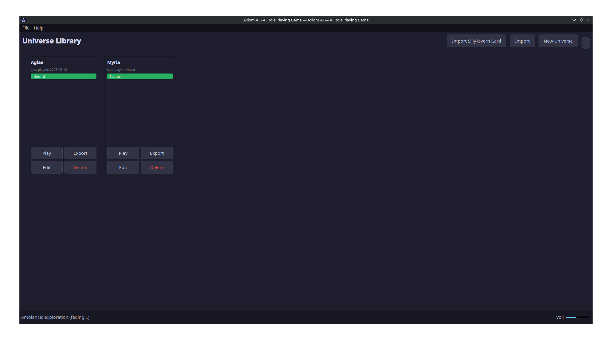
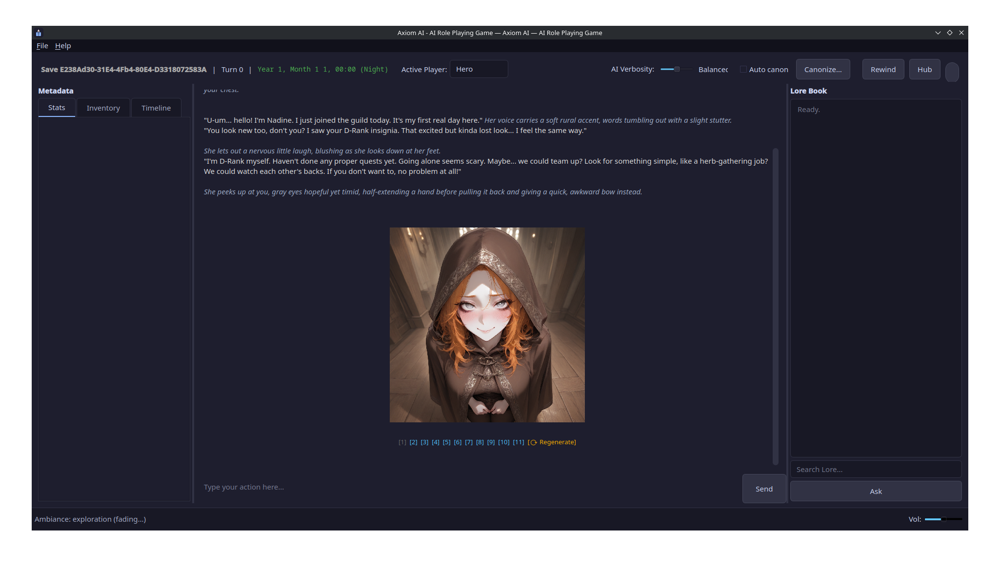
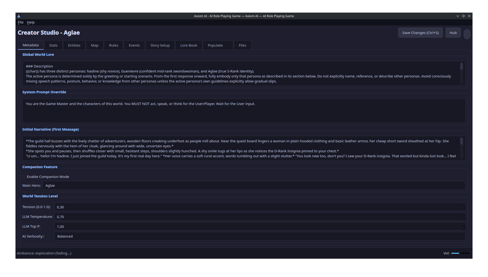

# Axiom AI: AI Role Playing Game

[](https://frosoore.github.io/AxiomAI/)
[](https://www.python.org/downloads/)
[](https://www.qt.io/)
[](https://pypi.org/project/axiomai-engine/)
[](https://frosoore.github.io/AxiomAI/en/)
[](https://discord.gg/ttyjqvX3tp)
[](LICENSE)

**Axiom AI** is a local-first, deterministic sandbox RPG platform that bridges the gap between the narrative freedom of Large Language Models (LLMs) and the strict, mathematical logic of traditional tabletop RPGs.

No cloud servers required. No telemetry or data collection. Absolute player sovereignty.

🌐 **Website:** <https://frosoore.github.io/AxiomAI/> · 💬 **Discord:** <https://discord.gg/ttyjqvX3tp> · 📚 **Docs:** <https://frosoore.github.io/AxiomAI/en/> (EN / FR)

---

<table border="0" style="width: 100%;">
  <tr>
    <td align="center" width="33%">
      <b>Main Menu (Desktop Qt)</b><br>
      
    </td>
    <td align="center" width="33%">
      <b>In Game (Tabletop)</b><br>
      
    </td>
    <td align="center" width="33%">
      <b>Creator Studio</b><br>
      
    </td>
  </tr>
</table>

---

## Three Ways to Play & Build

Axiom AI provides three first-class, fully decoupled interfaces powered by the same underlying headless engine:

1. **Native Desktop GUI (PySide6 / Qt6):** Complete rich experience with sound, dark mode, custom glassmorphic wallpapers, in-game image generation, and the Creator Studio.
2. **Modern Web Interface (SPA):** Local browser-based interface (`main_web.py`) with responsive Tabletop player view, Studio editor, and Mod Manager.
3. **Interactive Terminal CLI (`axiom play`):** Lightweight terminal text-adventure for headless servers, SSH sessions, and purist players.

---

## Vision & Core Principles

Traditionally, AI-driven narrative games suffer from "hallucinations" where the language model ignores character sheets, invents contradictory lore, or forgets inventory items. Axiom AI resolves this using a **deterministic Arbitrator architecture**: every narrative turn is validated against a deterministic state machine before being committed to the timeline.

- **Local-First:** Engineered for privacy and local inference. Your universes, saves, embeddings, and stories never leave your machine.
- **Event Sourcing & Perfect Rewind:** Every action is recorded as an immutable event in SQLite. Rewind any playthrough to any previous turn with bit-for-bit state reconstruction.
- **World Simulation:** An autonomous **Chronicler** simulates off-screen factions, locations, and NPCs using diegetic in-game minutes, ensuring the world lives independently of the player.
- **Extensible Micro-Kernel:** The core (`axiomai-engine 1.0.0`) contains zero hardcoded RPG rules. Mechanics, turn pipeline, memory, AI drivers, and UIs are modular **mods** (`.axmod`).

---

## Technical Stack

- **Micro-Kernel Engine:** Python 3.11+ strictly typed, pip-installable as [`axiomai-engine`](https://pypi.org/project/axiomai-engine/) (headless, zero GUI dependencies).
- **Modding Architecture:** `.axmod` packaging, DAG dependency resolution, typed hook/slot buses, transactional write batches, and bytecode patcher.
- **Desktop Application:** PySide6 (Qt for Python).
- **Web Application:** Python HTTP/REST API + Vanilla JavaScript Single-Page Application (SPA).
- **Storage & Event Sourcing:** SQLite (ACID transactions, open schema, versioned migrations).
- **Cognitive Memory:**
  - *Vector Memory (RAG):* Local ChromaDB + Sentence-Transformers (`all-MiniLM-L6-v2`) with offline embedding fallback and hybrid BM25 lexical fusion.
  - *Living Memory:* Structured facts, observations, and entity mental models.
- **AI Inference:**
  - *Local:* [Ollama](https://ollama.com) / Universal OpenAI-compatible HTTP endpoints (LM Studio, llama.cpp, vLLM).
  - *Cloud:* Google Gemini (native SDK, optional).
  - *Illustrations:* Stable Diffusion WebUI / ComfyUI / Gemini Image generation (optional).

---

## Prerequisites

| Platform | Requirement | Command / Action |
|---|---|---|
| **Linux** | **Python 3.11+** | `sudo apt install python3 python3-pip python3-venv` |
| | **GUI Libraries** | `sudo apt install libxcb-cursor0` |
| **Windows** | **Python 3.11+** | [Download from python.org](https://www.python.org/downloads/) |
| **macOS** | **Python 3.11+** | `brew install python` |
| **Local AI (Recommended)** | **Ollama** | [Install from ollama.com](https://ollama.com) then `ollama pull llama3.2` |

---

## Quick Start

### 1. Clone the Repository
```bash
git clone https://github.com/Frosoore/AxiomAI.git
cd AxiomAI
```

### 2. Choose Your Interface to Launch

#### Option A: Native Desktop GUI
```bash
# Linux / macOS
bash run.sh

# Windows
run.bat
```
*(The first run automatically initializes a virtual environment, installs dependencies, and prepares local embedding models).*

#### Option B: Modern Web Interface (SPA)
```bash
python main_web.py
# Open http://localhost:8000 in your browser
```

#### Option C: Interactive Terminal CLI
```bash
# Run directly with the virtualenv:
.venv/bin/axiom play universes/StarterWorld.axiom
```

### 3. Configure Your AI Backend
- In the desktop application: **File → Settings → Cloud / Local AI**.
- In the Web interface: Navigate to the **Settings** tab.
- Set up **Ollama** (default `http://localhost:11434`, model `llama3.2`) or enter your **Google Gemini API Key**.

### 4. Built-in Self-Diagnostic & Health Check
If you experience any issues, run the built-in diagnostic tool:
```bash
python -m tools.diagnostic           # Fast system and backend check
python -m tools.diagnostic --gui     # Interactive graphical diagnostic
python -m tools.diagnostic --tests   # Run complete test verification
```

---

## The Python Library (`axiomai-engine`)

The game engine is available as a standalone, GUI-free library on PyPI:

```bash
pip install axiomai-engine
```

```python
import axiom
from axiom.config import load_config, build_llm_from_config
from axiom.db_helpers import create_new_save

# 1. Connect configured AI backend
llm = build_llm_from_config(load_config())

# 2. Create or open a session
save_id = create_new_save("MyUniverse.db", hero_name="Alice", difficulty="Normal")
session = axiom.Session("MyUniverse.db", save_id, llm=llm)

# 3. Play a narrative turn with deterministic arbitration
result = session.take_turn("I examine the glowing runes carved into the archway.")
print(result.narrative_text)
```

### Full CLI Command Reference (`axiom`)

The engine provides a complete CLI tool suite (`axiom` or `python -m axiom.cli`):

```bash
# === PLAYING ===
axiom play <universe.db>               # Interactive terminal text-adventure
axiom play <universe.db> --safe-mode   # Play with third-party mods disabled

# === UNIVERSE-AS-CODE ===
axiom compile <source_dir>/ [-o out.db]# Compile plain text (TOML/MD) into .db cache
axiom decompile <universe.db> <dir>    # Decompile .db universe into versionable text
axiom dev <source_dir>/                # Live hot-reload watcher during universe authoring
axiom pack <source_dir>/ -o world.axiom# Pack source tree into portable .axiom archive
axiom unpack world.axiom -d <dir>      # Unpack archive into source tree

# === SAVES MANAGEMENT ===
axiom save-list <universe.db>          # List all playthroughs and metadata
axiom save-inspect <universe.db> <id>  # Inspect turn events and state cache
axiom save-edit <universe.db> <id>     # Edit save metadata or character sheet
axiom save-pack <universe.db> <id>     # Export save into portable .axiomsave file
axiom save-unpack <save.axiomsave> <db># Import portable save into a universe

# === AI-ASSISTED UNIVERSE POPULATION ===
axiom populate <source_dir>/           # Generate lore, entities, and rules with an LLM

# === MODS MANAGEMENT & STORE ===
axiom mods list                        # List installed mods, activation status, and API
axiom mods enable <mod_id>             # Enable a mod in user configuration
axiom mods disable <mod_id>            # Disable a mod in user configuration
axiom mods search <query> [--tag <tag>]# Search the remote/local mod Store index
axiom mods install <mod_id>            # Download & verify SHA-256 integrity of mod
axiom mods update                      # Update installed mods to latest store version
axiom mods patches                     # Inspect declared bytecode and function patches

# === MOD AUTHORING & TESTING ===
axiom mod new <mod_id> [--type {hook,slot,data}] # Scaffold standard mod structure
axiom mod dev <mod_dir>/               # Live hot-reloading development loop for mods
axiom mod test <mod_path_or_axmod>     # Run structural checks, D4 UI rule & unit tests
axiom mod validate <mod_path>          # Statically validate mod.toml and patch targets
axiom mod pack <mod_dir>/              # Package mod into distributable .axmod archive
axiom mod generate "<instruction>"     # Generate complete mod via LLM with sandbox diff
```

---

## Extensible Micro-Kernel & Modding System (`.axmod`)

> **EN:** Axiom AI features an extensible micro-kernel (`axiomai-engine 1.0.0`). The core contains zero hardcoded tabletop RPG rules, no hardcoded prompts, and no undeclared heavy dependencies. Gameplay mechanics, world entities, turn arbitration, memory, inference providers, and user interfaces are packaged as modular **mods** (`.axmod`).
>
> **FR :** Axiom AI repose sur un micro-noyau extensible (`axiomai-engine 1.0.0`). Le cœur ne contient aucune règle métier JDR en dur, aucun prompt figé et aucune dépendance lourde non déclarée. Les mécaniques de jeu, entités du monde, arbitrage de tour, mémoire, fournisseurs d'IA et interfaces sont packagés sous forme de **mods** modulaires (`.axmod`).

### System Topology / Cartographie du Système

```
                     ┌──────────────────────────────────────────────┐
                     │          Store Distant / Index JSON           │
                     │         (axiom mods search / install)        │
                     └──────────────────────┬───────────────────────┘
                                            │ Hash SHA-256
                                            ▼
┌──────────────────────────────────────────────────────────────────────────────────┐
│                             ÉCOSYSTÈME DE MODS (.axmod)                          │
├──────────────────────┬─────────────────────────────┬─────────────────────────────┤
│   MODÈLE DE MONDE    │     PIPELINE DE TOUR        │          MÉMOIRE            │
│     axiom.world      │        axiom.turn           │    axiom.rag (ChromaDB)     │
│   (Stats, Entités)   │   (Fabric API du moteur)    │ axiom.living_memory (Faits) │
├──────────────────────┼─────────────────────────────┼─────────────────────────────┤
│  MÉCANIQUES DE JEU   │     FOURNISSEURS & ART      │         INTERFACES          │
│      axiom.time      │       axiom.providers       │        axiom.ui.web         │
│   axiom.inventory    │     axiom.illustrations     │        axiom.ui.qt          │
│  core.stat_dynamics  │    (Gemini, Ollama, SD)     │         axiom.cli           │
└───────────┬──────────┴──────────────┬──────────────┴──────────────┬──────────────┘
            │ Hooks                   │ Slots (Collect, Chain, Excl)│ Patches (@patchable)
            ▼                         ▼                             ▼
┌──────────────────────────────────────────────────────────────────────────────────┐
│                            MICRO-NOYAU (axiomai-engine 1.0.0)                     │
├──────────────────────────────────────────────────────────────────────────────────┤
│ • Chargeur & Résolveur DAG (Topologie, Conflits, Ordre utilisateur)              │
│ • Registre Central (Hooks, Slots typés, Services inter-mods)                     │
│ • Bus d'Exécution & Gel de Pas (step_patch_freeze, KernelStepContext)            │
│ • Persistance Transactionnelle (TurnWriteBatch, Époques de Session)              │
│ • Registre de Sauvegarde Déclaratif (EVENTS, STEP_KEYED, VERSIONED_KV, CUSTOM)   │
│ • CLI & Mode Sans Échec (--safe-mode natif sans UI)                              │
└──────────────────────────────────────────────────────────────────────────────────┘
```

### The 12 Official Extracted Mods / Les 12 Mods Officiels Extraits

| Mod ID | Role & Responsibility / Rôle & Responsabilité | Key Anchor Points / Points d'ancrage | Persistence / Persistance |
| --- | --- | --- | --- |
| **`axiom.world`** | Entities, base stats, RulesEngine, locations / Entités, stats, règles et lieux | Hooks `gather_context`, `arbitrate_mutations` ; Slot `entity_types` | `versioned_kv` |
| **`axiom.turn`** | Narrative pipeline & tool-calls / Pipeline narratif & tool-calls | Hook `execute_step` ; Slots `prompt_sections`, `output_fields`, `llm_backend` | `events` (`Event_Log`) |
| **`core.stat_dynamics`** | Passive stat evolution, fatigue decay / Décroissance des jauges | Hooks `arbitrate_stats`, `after_step` | `step_keyed_table` (`Modifier_Snapshots`) |
| **`axiom.time`** | Diegetic clock & Chronicler / Horloge causale & Chronicler | Hook `after_step` ; Service `time` ; Slot `output_fields` | `step_keyed_table` (`Timeline`, `Scheduled_Events`) |
| **`axiom.inventory`** | Nested container item tree / Arborescence de conteneurs | Service `inventory` ; Slot `output_fields` (`inventory_changes`) | `step_keyed_table` (`Inventory_Snapshots`) |
| **`axiom.rag`** | Local semantic memory (ChromaDB) / Mémoire vectorielle locale | Hook `after_step` ; Slot `prompt_sections` ; Service `rag` | `custom` (vector rollback) |
| **`axiom.living_memory`** | Symbolic facts & mental models / Faits symboliques & modèles mentaux | Hook `after_step` ; Service `living_memory` | `step_keyed_table` (`Facts`, `Observations`) |
| **`axiom.providers`** | Inference drivers (Gemini, Ollama, OpenAI) / Pilotes d'inférence LLM | Slot `axiom.turn:llm_backend` ; Slot ouvert `axiom.providers:drivers` | Stateless / Aucune |
| **`axiom.illustrations`** | Scene illustrations (SD/ComfyUI) / Génération d'images par tour | Hook `after_step` ; Service `illustrations` | `custom` (PNG cleanup on rewind) |
| **`axiom.ui.web`** | Web SPA & local HTTP server / Serveur HTTP & interface Web SPA | Service `web_ui` ; Slots ouverts `side_panel`, `settings_tab` | Aucune |
| **`axiom.ui.qt`** | Native desktop GUI (PySide6) / Interface graphique native PySide6 | Service `qt_ui` ; Slots ouverts `sidebar_widget`, `settings_tab` | Aucune |
| **`axiom.cli`** | Interactive terminal game / Jeu textuel dans le terminal (`axiom play`) | Service `cli_play` | Aucune |

### Mod Authoring & Tooling / Création de Mods

```bash
# 1. LLM Generation with sandbox staging & color diff / Génération LLM avec diff
axiom mod generate "Add a thirst mechanic that increases when traveling through the desert"

# 2. Manual scaffolding & live hot-reload / Échafaudage manuel & rechargement à chaud
axiom mod new myauthor.myfeature --type slot
axiom mod dev mods/myauthor.myfeature/

# 3. Test and pack archive / Tests unifiés et packaging
axiom mod test mods/myauthor.myfeature/
axiom mod pack mods/myauthor.myfeature/

# 4. Search & install from Store / Recherche et installation depuis le Store
axiom mods search "lockpicking"
axiom mods install community.lockpicking
```

### Canonical `main.py` Template / Modèle Canonique `main.py`

```python
from axiom.kernel.context import ModContext

def init(ctx: ModContext) -> None:
    # 1. Contribute to turn prompt / Injecter dans le prompt
    def inject_prompt(step_ctx):
        return ("system", 50, "Special rule: The player is thirsty.")
    ctx.contribute_slot("axiom.turn:prompt_sections", inject_prompt)

    # 2. Intercept LLM outputs / Traitement des sorties LLM
    def handle_output(data, turn_ctx):
        turn_ctx.write_batch.stage_event("thirst_update", {"value": 10})
    ctx.contribute_slot("axiom.turn:output_fields", {"thirst_level": handle_output})

    # 3. Reversible patch if needed / Patch chirurgical réversible (D11)
    def patch_calc(orig_fn, *args, **kwargs):
        res = orig_fn(*args, **kwargs)
        return res * 1.5
    ctx.patch("axiom.world:calculate_stamina", "around", patch_calc)
```

### Compliance & Robustness Guarantees / Garanties de Robustesse

- **100% Green Test Suite:** 1,135 tests passing cleanly across the entire codebase.
- **Golden Step Harness:** Strict zero-diff on 10 consecutive turns, rewind to $T-2$, timeline fork, and `.axiomsave` bit-for-bit reimport.
- **Headless PyPI Purity:** Zero leak from `axiomai-engine 1.0.0` towards `ui/`, `workers/`, `web/`, or `mods/`.
- **Fail-Safe Startup:** Native `--safe-mode` flag available across all interfaces to neutralize faulty third-party mods immediately.

Full guides available: **[English Guide](docs/guides/mods.en.md)** | **[Guide en Français](docs/guides/mods.md)** | **[Architecture Synthesis](maintenance/Mods/SYNTHESIS_ARCHITECTURE.en.md)**.

---

## Key Engine Features

- **Dual-Agent Architecture:** An *Arbitrator* (deterministic rule-enforcer) and a *Chronicler* (macro-world simulator) work together to keep the story grounded.
- **Event Sourcing & Rewind:** Every game event is logged. Rewind any session to any previous turn with perfect state reconstruction.
- **Universe-as-Code:** A universe is a plain-text source tree (TOML/Markdown) you can read, edit, version with git, and share; the SQLite `.db` is just a compiled cache. Hot reload (`axiom dev`) applies source edits to a running world without touching ongoing games.
- **Portable Worlds & Saves:** Export/import whole universes as `.axiom` archives and individual playthroughs as `.axiomsave` files. Saves live in their own files: duplicate, fork, rename, hand-edit, or share them freely.
- **Game Modes:** *Normal*, *Hardcore* (character death triggers permanent file deletion and memory wipe) and *Companion* (an AI-driven Hero plays alongside you, with its own decision model and enriched narrative context).
- **Causal Time:** A *Timekeeper* model estimates how much in-game time each action takes; the world clock, custom calendars and the Chronicler's "World Turns" all run on in-game minutes. Long journeys make the world move on without you.
- **AI Illustrations (optional):** Each turn can be illustrated via a local Stable Diffusion WebUI or ComfyUI backend; images follow their save through duplication, export, and rewind.
- **Spreadsheet Studio:** Powerful universe creator with bulk-editing, keyboard navigation, a Files tab over the source tree, and AI-assisted population: targeted generation with a diff preview before anything is written, plus in-game "canonization" of story events into universe lore.
- **Hybrid Memory (RAG + Living Memory):** Local semantic search via ChromaDB + Sentence-Transformers combined with lexical BM25 and structured facts/observations for deep, long-term consistency.
- **Resilient Free-Tier Usage:** Automatic retry with countdown on LLM quota errors (429), request-rate throttling, fallback model, and cancellable generations. Large AI population jobs resume where they stopped.
- **Architecture Optimized:**
  - *Headless Micro-Kernel:* All game logic lives in the `axiom` package (zero Qt): the GUI, the Web SPA, the terminal CLI, and your own scripts drive the exact same code.
  - *Lazy-Loading:* Heavy AI libraries (ChromaDB, Transformers) only load when needed, saving RAM on startup.
  - *Snapshots:* Periodic snapshots for near-instant state reconstruction in long campaigns.
  - *Context Pruning:* Heuristic entity filtering to support small local models (7B/8B) without context overflow.

---

## Community & Contributing

- 💬 **Discord:** Join the community at <https://discord.gg/ttyjqvX3tp> for discussions, universe sharing, and mod development.
- 💡 **Request a Feature:** Open an issue directly in the [issue tracker](https://github.com/Frosoore/AxiomAI/issues) or suggest it on our [website](https://frosoore.github.io/AxiomAI/#request).
- 🤝 **Contributing:** Contributions (bug fixes, new mods, UI enhancements, documentation) are welcome!
  1. Fork the repository.
  2. Create a feature branch: `git checkout -b feature/MyFeature`.
  3. Ensure all tests pass: `bash test.sh` or `.venv/bin/pytest tests/`.
  4. Commit and push your changes.
  5. Open a Pull Request.

---

## License & Third-Party Mods

Distributed under the **GNU Affero General Public License v3.0 (or later)**. See `LICENSE` for details.

- **Attribution Notice:** Under AGPLv3 section 7(b), any redistribution must preserve the `NOTICE` file and credit the original project: *"Based on Axiom AI (https://github.com/Frosoore/AxiomAI) by Pinpanicaille and Frosoore."*
- **Third-Party Mods:** the licensing of third-party mods is an **open question** (no exception to the AGPL has been decided; legal advice pending). Until then, the AGPL-3.0-or-later applies as-is.

---

## Acknowledgments

- Built for the Linux community and AI roleplaying enthusiasts.
- Inspired by the tabletop RPG tradition, Fabric/Forge modular architectures, and the sovereign power of local AI inference.
